# MyPromise - Technical Documentation

## Overview

This project implements `MyPromise`, a pedagogical TypeScript reimplementation of JavaScript Promises from scratch, following the Promise/A+ specification. The implementation demonstrates core concepts including state management, asynchronous execution via microtasks, chaining, and promise unwrapping.

---

## Architecture

### Core Components

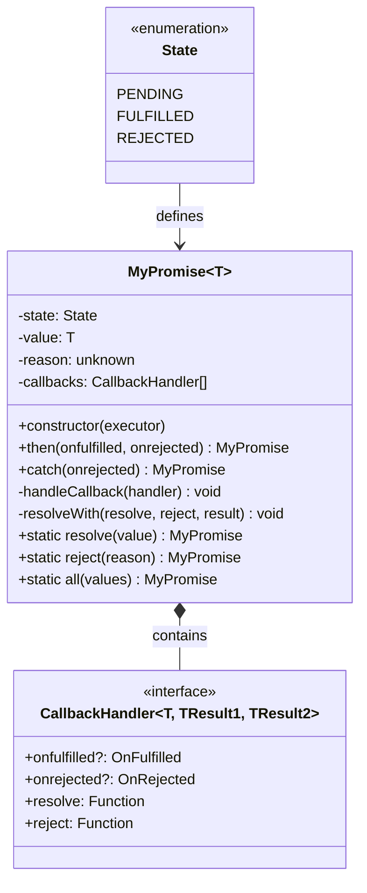

---

## State Machine

### Promise Lifecycle

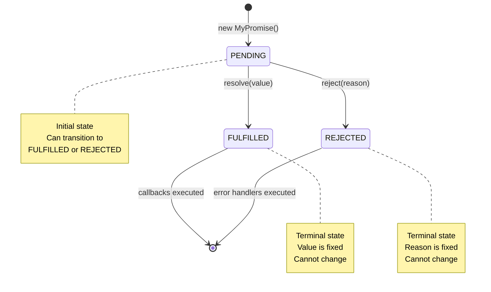

### State Transition Rules

1. **PENDING** → **FULFILLED**: Only via `resolve(value)` call
2. **PENDING** → **REJECTED**: Only via `reject(reason)` call
3. Once in FULFILLED or REJECTED state, the promise is **settled** and immutable
4. Multiple resolve/reject calls are ignored after first settlement (line 30, 39)

---

## Asynchronous Execution Model

### Microtask Queue with `queueMicrotask()`

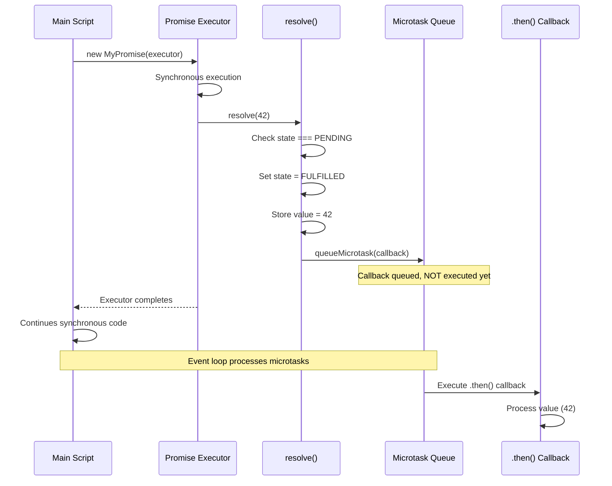

### Why `queueMicrotask()`?

The implementation uses `queueMicrotask()` instead of synchronous execution to comply with Promise/A+ specification:

**Synchronous (WRONG)**:
```typescript
// Would execute immediately, breaking async semantics
handler.onfulfilled(this.value)
```

**Asynchronous (CORRECT)**:
```typescript
// Schedules for next microtask, preserving async behavior
queueMicrotask(() => this.handleCallback(handler))
```

**Key Benefits**:
- Ensures consistent async behavior regardless of promise state
- Maintains proper execution order (main script → microtasks → macrotasks)
- Prevents stack overflow in deep chaining scenarios
- Matches native Promise semantics exactly

---

## Promise Chaining

### The `.then()` Method Flow

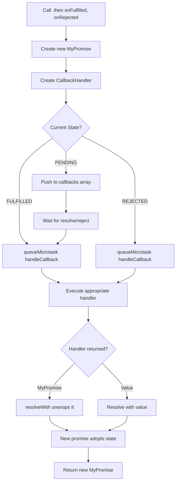

### Chaining Example Execution

```typescript
p.then(val => val * 2)       // Returns MyPromise #1
  .then(val => val + 10)     // Returns MyPromise #2
  .then(console.log)         // Returns MyPromise #3
```

**What happens internally**:

1. First `.then()` creates **MyPromise #1** with its own `resolve/reject`
2. Handler `{ onfulfilled: val => val * 2, resolve, reject }` is stored
3. When `p` resolves, handler executes and calls `resolveWith()`
4. `resolveWith()` resolves MyPromise #1 with `val * 2`
5. Second `.then()` creates **MyPromise #2**, chained to #1
6. Process repeats for each link in the chain

---

## Promise Unwrapping (resolveWith)

### Handling Returned Promises

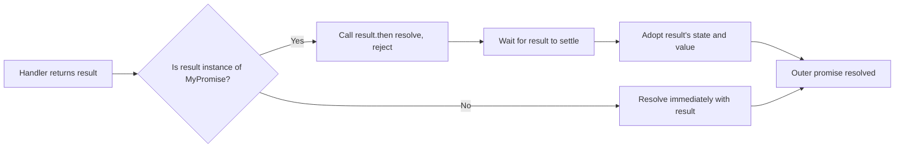

### Code Implementation

```typescript
private resolveWith<TResult>(
  resolve: (value: TResult) => void,
  reject: (reason: unknown) => void,
  result: TResult | MyPromise<TResult>,
): void {
  if (result instanceof MyPromise) {
    // Unwrap: chain the outer promise to the inner promise
    result.then(resolve, reject)
  } else {
    // Direct resolution with plain value
    resolve(result)
  }
}
```

**Example**:
```typescript
p.then(() => {
  return new MyPromise(resolve => 
    setTimeout(() => resolve("done"), 100)
  )
})
// Next .then() waits for the returned promise
```

---

## Static Methods

### MyPromise.resolve()

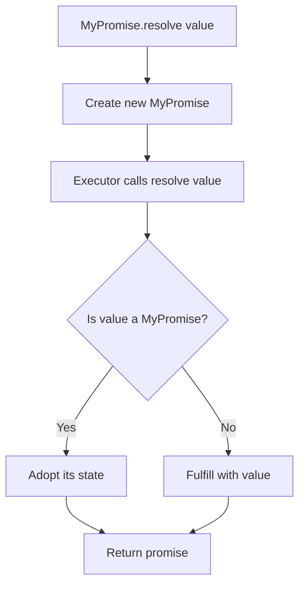

**Implementation**:
```typescript
static resolve<T>(value: T): MyPromise<T> {
  return new MyPromise<T>(resolve => resolve(value))
}
```

### MyPromise.reject()

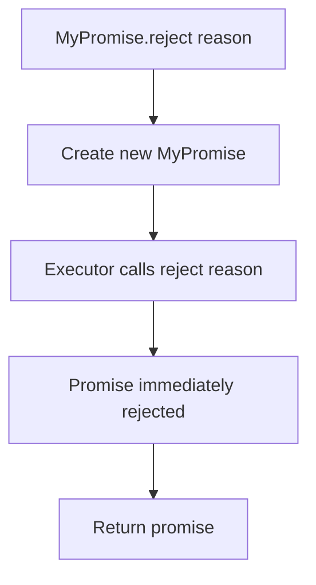

**Implementation**:
```typescript
static reject(reason: any): MyPromise<never> {
  return new MyPromise<never>((_, reject) => reject(reason))
}
```

---

## MyPromise.all() Implementation

### Fail-Fast Behavior

```mermaid
flowchart TD
    A[MyPromise.all promises] --> B{Array empty?}
    B -->|Yes| C[Resolve immediately with []]
    B -->|No| D[Wrap non-promises with MyPromise.resolve]
    
    D --> E[Attach .then to each promise]
    E --> F{Any promise rejects?}
    
    F -->|Yes| G[Reject immediately with error]
    F -->|No| H[Store result at correct index]
    
    H --> I{All promises resolved?}
    I -->|No| E
    I -->|Yes| J[Resolve with results array]
    
    G --> K[Return rejected promise]
    C --> L[Return resolved promise]
    J --> L
```

### Execution Flow

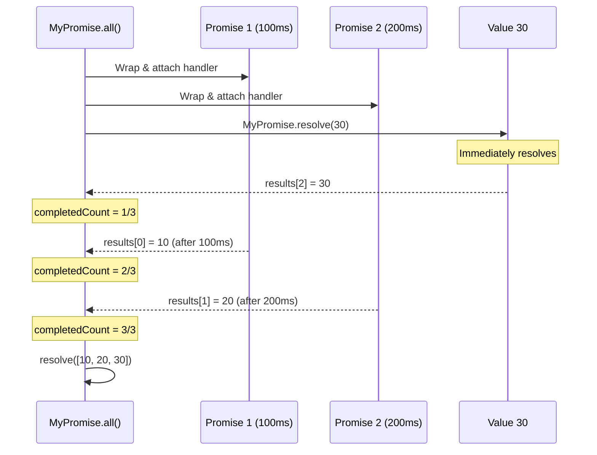

### Key Features

1. **Order Preservation**: Results maintain original array order regardless of resolution timing
2. **Fail-Fast**: Any rejection immediately rejects the entire `all()` promise
3. **Non-Promise Handling**: Plain values wrapped with `MyPromise.resolve()`
4. **Empty Array**: Returns immediately resolved promise with `[]`

**Implementation** (lines 133-159):
```typescript
static all<T>(values: Array<T | MyPromise<T>>): MyPromise<T[]> {
  return new MyPromise<T[]>((resolve, reject) => {
    const results: T[] = []
    let completedCount = 0
    
    if (values.length === 0) {
      resolve(results)
      return
    }
    
    values.forEach((value, index) => {
      const promise = value instanceof MyPromise 
        ? value 
        : MyPromise.resolve(value)
      
      promise.then(
        (resolvedValue) => {
          results[index] = resolvedValue  // Preserve order
          completedCount++
          if (completedCount === values.length) {
            resolve(results)
          }
        },
        (error) => {
          reject(error)  // Fail-fast
        }
      )
    })
  })
}
```

---

## Complete Execution Example

### Test Code Flow

```mermaid
gantt
    title Promise Execution Timeline
    dateFormat X
    axisFormat %ms
    
    section Main Thread
    Script Start           :0, 500
    Console "1. Executor"  :0, 500
    Console "2. Fin"       :500, 500
    
    section Microtasks (500ms)
    Resolve p with 42      :500, 500
    First .then callback   :500, 500
    Second .then callback  :500, 500
    
    section Macrotasks
    setTimeout 500ms       :0, 1000
    setTimeout 200ms       :1000, 1200
    Third .then callback   :1200, 500
    
    section Promise.all
    Promise 1 (100ms)      :0, 600
    Promise 2 (200ms)      :0, 700
    all() resolves         :700, 500
```

### Expected Output Order

```
1. Executor synchrone              ← Synchronous
2. Fin du script principal         ← Synchronous
3. Résolution asynchrone           ← After 500ms (macrotask)
4. Premier then: 42                ← Microtask (after resolve)
5. Deuxième then (chaîné): 84      ← Microtask (queued by previous then)
6. Troisième then: Success!        ← Microtask (after 200ms setTimeout)
```

**Why this order?**

1. Executor runs **synchronously** on creation
2. `setTimeout` schedules macrotask (500ms delay)
3. Main script continues: prints "2. Fin du script principal"
4. After 500ms: setTimeout fires, calls `resolve(42)`
5. `resolve()` queues microtask for callback execution
6. Event loop processes microtask queue:
   - First `.then()` executes, returns `84`
   - Second `.then()` executes (queued by first), returns new Promise
   - That Promise resolves after 200ms, queuing another microtask
   - Third `.then()` executes with "Success!"

---

## Type System

### Generic Type Flow

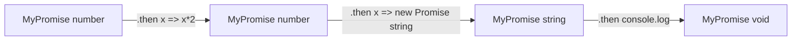

### Type Definitions

```typescript
// Handler types with generics
type OnFulfilled<T, TResult1> = 
  (value: T) => TResult1 | MyPromise<TResult1>

type OnRejected<TResult2> = 
  (reason: unknown) => TResult2 | MyPromise<TResult2>

// Callback handler interface
interface CallbackHandler<T, TResult1, TResult2> {
  onfulfilled?: OnFulfilled<T, TResult1> | null
  onrejected?: OnRejected<TResult2> | null
  resolve: (value: TResult1 | TResult2) => void
  reject: (reason: unknown) => void
}
```

**Type Safety Features**:
- Generic `T` propagates through promise chain
- `resolveWith` handles both `T` and `MyPromise<T>` correctly
- `.catch()` narrows return type appropriately
- `MyPromise.all()` infers array element types

---

## Error Handling

### Error Propagation Chain

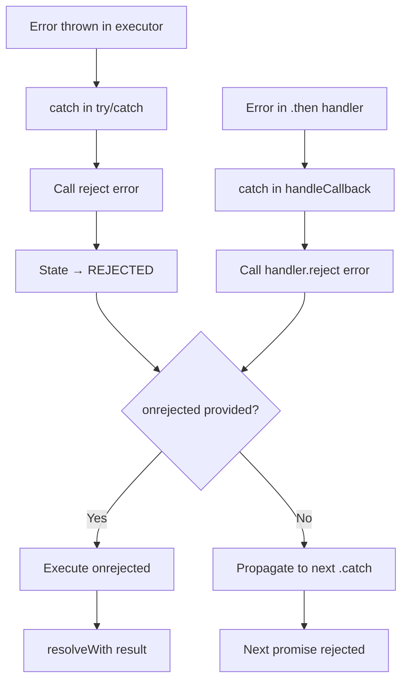

### Implementation Details

**Executor Error Capture** (lines 47-51):
```typescript
try {
  executor(resolve, reject)
} catch (error) {
  reject(error)  // Automatically reject on synchronous error
}
```

**Handler Error Capture** (lines 99-101):
```typescript
catch (error) {
  handler.reject(error)  // Reject returned promise
}
```

---

## Key Design Decisions

### 1. Microtask vs Macrotask

**Decision**: Use `queueMicrotask()` instead of `setTimeout(fn, 0)`

**Rationale**:
- Microtasks execute before next macrotask
- Matches native Promise behavior exactly
- Prevents unnecessary delays
- Proper priority in event loop

### 2. Callback Queue Storage

**Decision**: Store callbacks in array when pending

**Rationale**:
- Allows multiple `.then()` calls before resolution
- Preserves registration order
- Enables batch processing on settlement

### 3. Separate `handleCallback()` Method

**Decision**: Extract callback logic into private method

**Rationale**:
- Reused by both immediate and queued execution
- Centralizes error handling
- Cleaner separation of concerns

### 4. `resolveWith()` for Unwrapping

**Decision**: Dedicated method for promise resolution logic

**Rationale**:
- Handles both plain values and promises uniformly
- Recursive unwrapping support
- Prevents promise nesting (`MyPromise<MyPromise<T>>`)

---

## Compliance with Promise/A+

| Requirement | Implementation |
|-------------|----------------|
| States: pending, fulfilled, rejected | ✅ `State` enum (lines 1-5) |
| Immutable after settlement | ✅ Guard checks (lines 30, 39) |
| `.then()` returns new promise | ✅ Line 64 |
| Async callback execution | ✅ `queueMicrotask()` (lines 33, 42, 75) |
| Value passing through chain | ✅ `resolveWith()` (lines 104-114) |
| Error propagation | ✅ Try/catch in handleCallback (line 99) |
| Handler type validation | ✅ TypeScript types (lines 7-8) |
| Multiple `.then()` calls | ✅ Callbacks array (line 21) |

---

## Limitations & Differences from Native Promise

1. **No `finally()` method** - Not implemented in this version
2. **No `MyPromise.race()`** - Only `all()` implemented
3. **No `MyPromise.allSettled()`** - Not implemented
4. **No `MyPromise.any()`** - Not implemented
5. **Simplified type checking** - Uses `instanceof` instead of "thenable" detection
6. **No custom scheduler** - Hardcoded to `queueMicrotask()`

---

## File Structure

```
index.ts
├── State enum (lines 1-5)
├── Type definitions (lines 7-15)
├── MyPromise class (lines 17-159)
│   ├── Constructor & executor (lines 23-52)
│   ├── .then() method (lines 54-78)
│   ├── .handleCallback() (lines 80-102)
│   ├── .resolveWith() (lines 104-114)
│   ├── .catch() (lines 116-123)
│   ├── .resolve() static (lines 125-127)
│   ├── .reject() static (lines 129-131)
│   └── .all() static (lines 133-159)
└── Test code (lines 162-227)
```

---

## Summary

This `MyPromise` implementation demonstrates:

- **State management**: Strict PENDING → FULFILLED/REJECTED transitions
- **Asynchronous execution**: Proper microtask scheduling via `queueMicrotask()`
- **Chaining**: Each `.then()` returns a new promise that resolves with handler's return value
- **Unwrapping**: Returned promises are automatically flattened
- **Error handling**: Try/catch blocks propagate errors through the chain
- **Static utilities**: `resolve()`, `reject()`, and `all()` with fail-fast semantics

The implementation serves as an educational tool to understand the internals of JavaScript Promises and the event loop's microtask processing model.
